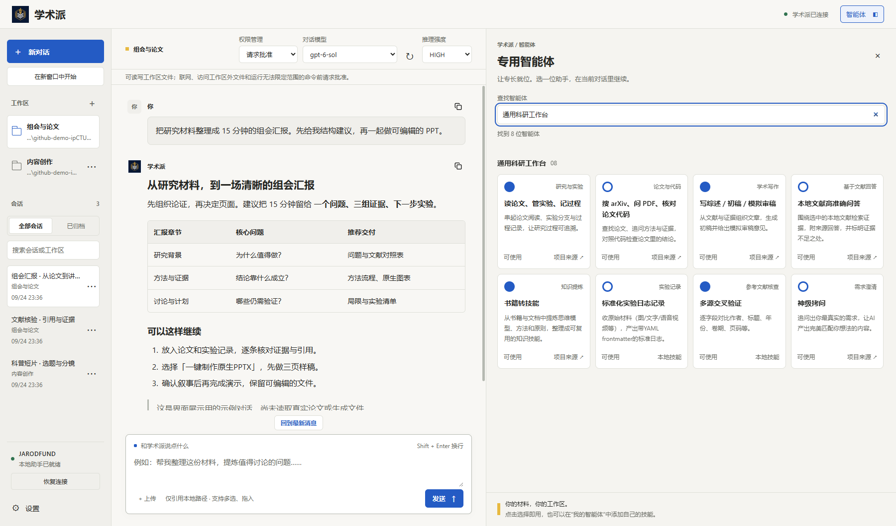
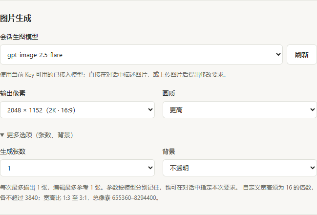
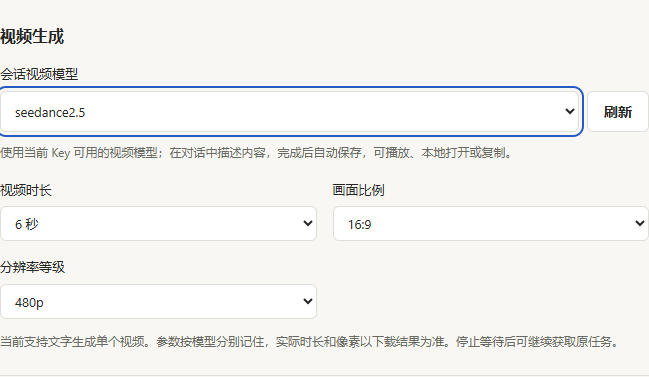
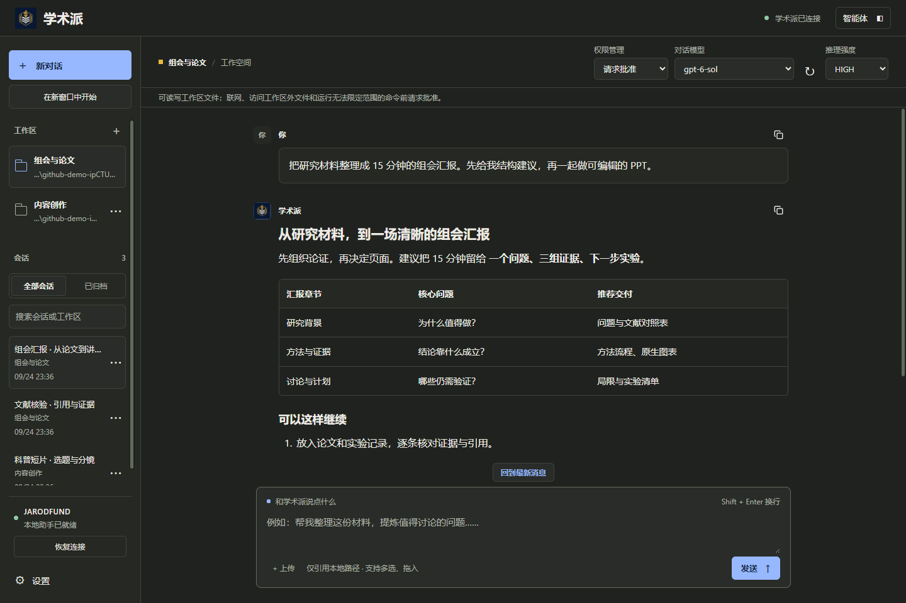

  

<h1 align="center">学术派 · Jarod-Pi</h1>

<a href="README.zh-CN.md">简体中文</a> · <a href="README.en.md">English</a>

<strong>From a question to your next deliverable.</strong>

Research, teaching, code and content creation in one desktop workspace. Local-first. Built on Pi.

  <a href="#start">Get started</a> ·
  <a href="#capabilities">Capabilities</a> ·
  <a href="#agents">Specialist agents</a> ·
  <a href="docs/GALLERY.md">Screenshots</a> ·
  <a href="#pi">Built on Pi</a> ·
  <a href="#development">Development</a>

<strong>18 built-in agents</strong> / <strong>Multiple models and sessions</strong> / <strong>Images and video</strong> / <strong>Your own skills</strong>

Actual Windows application, isolated demo sessions. Not a model benchmark; files mentioned in the example conversation were not generated. Click the image for full resolution.

Jarod-Pi brings Pi's agent engine, model access and specialist skills into a Chinese-language desktop interface. Select your materials, describe your goal, and let the agent read files, use tools, delegate work and save results to your workspace. Start with a question, then keep researching, writing, presenting and creating around the same materials.

> **Release status:** The first GitHub publication is being prepared in stages: the illustrated introduction and documentation come first; product source changes and public downloads are not published yet. Windows 0.2.3 has passed local runtime validation; 0.2.4 has been repackaged and is being validated. Linux and macOS are candidate packages awaiting native-machine testing. You need your own JarodFund API key; model calls and some external services may incur charges. See [downloads and platform status](docs/DOWNLOADS.md).

## One workspace, six kinds of work

<table>
<tr>
<td width="33%" valign="top">

### Research and evidence

Search papers, read PDFs, ask questions about literature, verify references and organize experiment logs. Keep questions, materials and the research process in one workspace.

</td>
<td width="33%" valign="top">

### Presentations you can edit

Choose native PPTX for editable text, charts and layouts, or image-based slides for a cohesive visual presentation.

</td>
<td width="33%" valign="top">

### Create within the conversation

Describe an image to generate or edit it; describe a scene to submit a video task. Preview, open locally or copy the result, then continue refining it.

</td>
</tr>
<tr>
<td valign="top">

### Tools and code

Search the web, look up Context7 documentation, operate a browser with Playwright, and use Pi Lens for structural code search, navigation and diagnostics.

</td>
<td valign="top">

### Multi-agent collaboration

Integrated subagents, sequential and parallel tasks, multi-role discussions, to-dos and background work help break down complex goals and bring results together.

</td>
<td valign="top">

### Your way of working

Run several conversations and add requirements during a task. Install personal skills to make your lab standards, lesson preparation or writing process readily accessible.

</td>
</tr>
</table>

## Pick a specialist and get started

Browse a four-column card layout or search by name, purpose or category. Select a card, then describe the task in your current conversation—no need to memorize each project's commands. Large dependencies download on demand when first needed, and installed shared resources can be reused.

| Category | Built-in agents |
| :--- | :--- |
| **Everyday work** | Native PPTX creation · Image-based presentations · Web search · Media downloads |
| **Research workspace** | Paper reading, experiments and research notes · arXiv search, PDF questions and paper/code checks · Literature reviews, drafts and mock reviews · Local literature Q&A · Book-to-skill conversion · Standardized experiment logs · Cross-source reference verification · Requirements interrogation |
| **Thinking frameworks** | Charlie Munger · Naval Ravikant · Elon Musk · Richard Feynman |
| **Content creation** | End-to-end content workflow · HTML/CSS-based video creation |
| **My agents** | Install your own complete skill folders and refresh to show them as personal cards |

Person-based agents are simulated analytical frameworks distilled from public materials, not statements by or endorsements from those individuals. Web-search and download entry names do not promise access to every website. Research results still require checking against original papers and data.

[Project sources](desktop/UPSTREAM-SOURCES.md) · [Pinned source revisions](desktop/specialists/sources.json) · [Tools and extensions](desktop/ECOSYSTEM.md)

## From source material to visual output

Choose image and video models independently of the chat model. Each family uses its own parameter mapping. Use a reference image for further edits; video tasks retain their task ID and download the result after generation completes.

<table>
<tr>
<th width="50%">Images: aspect ratio, pixels and quality</th>
<th width="50%">Video: duration, framing and resolution</th>
</tr>
<tr>
<td valign="top"></td>
<td valign="top"></td>
</tr>
</table>

Settings regions cropped at native resolution without upscaling. The model catalog uses demo data; actual availability depends on your account. These are configuration screens, not generated-output samples.

## Built for work that continues

- **Keep tasks running:** switch to another conversation without stopping the current task. Send additions to the active task or queue them for when it finishes.
- **Keep workspaces distinct:** view conversation history across workspaces; opening a session restores its working directory. Drafts, reading positions and approvals are session-specific.
- **Less file shuffling:** selecting or dragging local files initially references their paths. Tools read them as needed, and generated outputs are saved locally.
- **Inspect the process:** read Markdown, tables, code, reasoning and tool results in their respective views, with copying support.
- **A restrained interface:** Bauhaus-inspired geometry, a limited palette, light and dark themes, side-by-side panels on wide screens and a collapsible agent panel on narrower ones.

Actual dark-theme interface with demo content. More in the <a href="docs/GALLERY.md">screenshot gallery</a>.

## Why Pi is the foundation

**A small core, capabilities composed as needed.** Jarod-Pi uses Pi's model interaction, tool execution, sessions and context management. Specialist workflows come through extensions and skills: skill summaries are discoverable, while their full instructions are read for the task rather than keeping every workflow in context at all times.

Jarod-Pi adds the product layer:

| Pi foundation | Jarod-Pi integration |
| :--- | :--- |
| Models, tools and native sessions | Chinese desktop interface, workspaces, session switching and history management |
| Extensions and skills | Preconfigured tools, specialist cards and a personal-skills area |
| Native message queues | Mid-task additions, queued follow-ups and pending-message indicators |
| File and command execution | Local-path attachments, four approval modes, opening and copying results |
| Extensible agent runtime | JarodFund chat, image and video model access with model-specific parameters |

Multi-agent workflows come from integrated extensions such as **pi-subagents / council-mode**; we do not claim that every orchestration feature is built into Pi's core. An MCP adapter is integrated, but external services require their own configuration. Clients are not fully equivalent, and we do not promise “fewer prompts” or “stronger models” without comparative testing.

[Upstream Pi](https://github.com/earendil-works/pi) · [Preserved upstream introduction](docs/UPSTREAM-PI.md) · [Pi coding agent](packages/coding-agent)

## Start with a real task

1. **Choose your platform package.** Windows x64, Linux x64, or macOS Apple Silicon / Intel. Extract the entire archive; do not move only the launcher.
2. **Launch and connect.** On Windows, double-click `学术派.exe`. On Linux / macOS, run `bash 启动学术派.sh` from the extracted directory. Enter your own JarodFund API key in Settings.
3. **Choose your workspace and materials.** Add a working folder, select an agent and describe your goal. Missing large resources prompt for download when first needed.

> Read these papers, compare their research questions, methods and limitations with references to the originals, then help create a lab-meeting presentation.

> Review this project with separate subagents for logic and tests. Summarize their findings and wait for my confirmation before making changes.

> Plan an educational post about this concept, create illustrations and short video materials, and save them in the current workspace.

**[Downloads and platform status →](docs/DOWNLOADS.md)**　**[User guide →](desktop/README.md)**　**[Portable distribution →](desktop/PORTABLE.md)**

## Data, permissions and limits

**Local-first does not mean fully offline.** Sessions, personal skills and outputs are stored locally. File contents submitted to cloud models may still be sent to JarodFund or configured external services. Referencing a file path at selection time does not mean its contents will never leave the device during analysis.

Choose **Read only, Ask for approval, Smart approval or Full access**. These are application-level checks before tool execution, **not an operating-system sandbox**. Approving a command, script, extension or subagent also permits its internal operations. Install only trusted skills and handle sensitive materials carefully.

First startup, resource downloads, long conversations and model calls can take time. Website login, platform publishing and some external tools need additional accounts or authorization. Generated output, citation accuracy and platform availability are not guaranteed.

## Development and ecosystem

The desktop product lives in [`desktop/`](desktop). Pi's agent, model and terminal packages retain their structure and technical names so the upstream relationship remains traceable. The application interface and most detailed guides are currently in Chinese; this English README does not imply an English UI is available.

| Guide | Contents |
| :--- | :--- |
| [Desktop guide](desktop/README.md) | Sessions, approvals, media, personal skills and focused validation |
| [Portable edition](desktop/PORTABLE.md) | Platform launchers, data directories, resources and updates |
| [Ecosystem integration](desktop/ECOSYSTEM.md) | Pinned plugin versions, capabilities and validation limits |
| [Agent sources](desktop/UPSTREAM-SOURCES.md) | Upstream projects, adapted resources and dependencies |
| [Screenshots and reproduction](docs/GALLERY.md) | Real screenshots, isolated demo data and verification records |
| [GitHub publication preparation](docs/GITHUB-PUBLISHING.md) | Repository roles, security checks and remaining integration work |
| [Upstream Pi development guide](docs/UPSTREAM-PI.md) | Package layout, builds, development and supply-chain rules |

### Acknowledgments and licenses

Jarod-Pi builds on the work of **Mario Zechner and the Pi community**, alongside many open-source ecosystem projects. Pi's [MIT license and copyright notice](LICENSE) are preserved. Third-party agents, dependencies and resources retain their own licenses; the entire resource collection must not be described as MIT-licensed. See the ecosystem documentation and notices in the respective resource packages.

---

<strong>学术派 · Jarod-Pi</strong> A place to start, a record of the process, and results you can build on.

