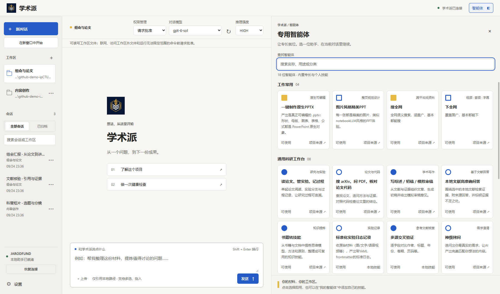
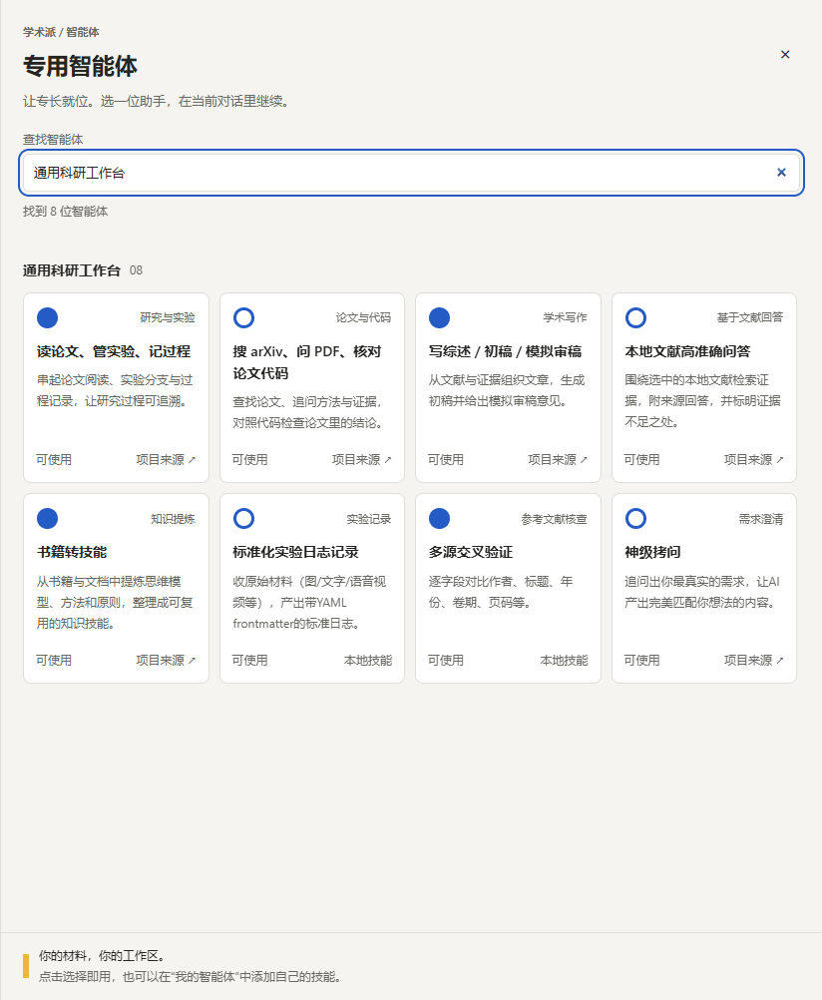

# 学术派 · 界面图册

[返回首页](../README.md)

以下截图来自 0.2.3 的真实 Windows / Electron 界面，使用独立临时配置与预置示例对话。未调用真实模型、图片或视频服务，未载入个人会话。模型目录为本地测试数据，不代表任一账户的实时模型权限。

图片按实际像素保存，没有放大、修图或拼接。设置截图和科研面板为应用区域原始像素裁切，不是界面设计稿。页面显示时可能缩小，点击图片可查看原图。

## 工作台

工作区、跨工作区会话、模型与推理选择、四列智能体卡片，以及本地文件入口。



## 科研工作流

示例对话演示 Markdown 标题、表格和列表；右侧通过分类筛选科研助手。对话中的方案是预置展示内容，不表示已读取论文或生成 PPT。


<details>
<summary>单独查看科研智能体面板</summary>



</details>

## 深色会话

收起右侧面板后，可将更多空间留给阅读与讨论。深色主题通过应用原有的系统配色支持呈现。


## 图片与视频设置

分别设置创作模型，按模型选择像素、比例、画质、时长与分辨率。这些截图展示配置能力，不是生成作品或服务商成功率证明。

| 图片生成 | 视频生成 |
| :---: | :---: |
|  |  |

## 截图复现与验证

脚本：[capture-github-screenshots.cjs](../desktop/scripts/capture-github-screenshots.cjs)。需要已准备好的开发版 Pi 运行时、Electron，以及 Playwright；不会自动安装依赖。

```powershell
# 在仓库根目录，使用项目所需的 Node 22。
# 如果 Playwright 不在模块搜索路径中，将 PLAYWRIGHT_PATH 指向其已安装目录。
node desktop/scripts/capture-github-screenshots.cjs
```

脚本只在 `.artifacts/` 创建自己的临时演示配置，完成后移除该精确目录。不改个人配置、工作文件或剪贴板。模拟账户与请求拦截使用现有测试 fixture；不提交推理请求。

每张图均检查本次写入、文件非空、PNG 解码、实际尺寸，并生成 [verification.json](assets/screenshots/verification.json)，记录尺寸、字节数、SHA-256、裁切及缩放情况。
